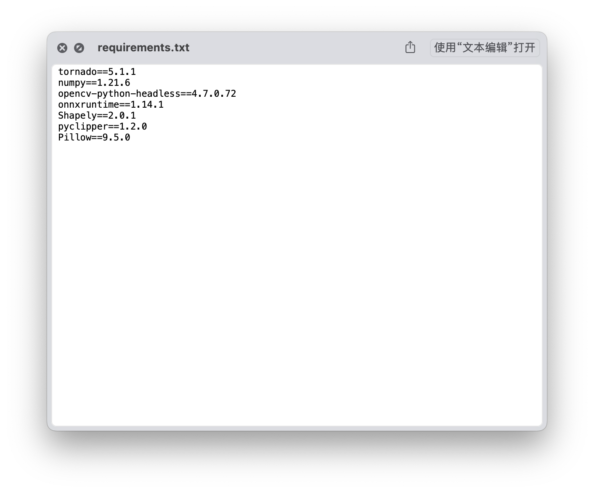
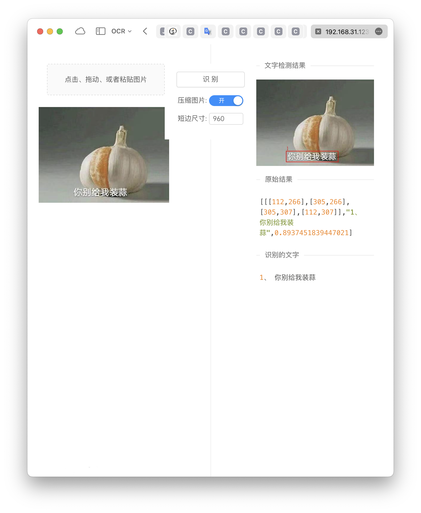
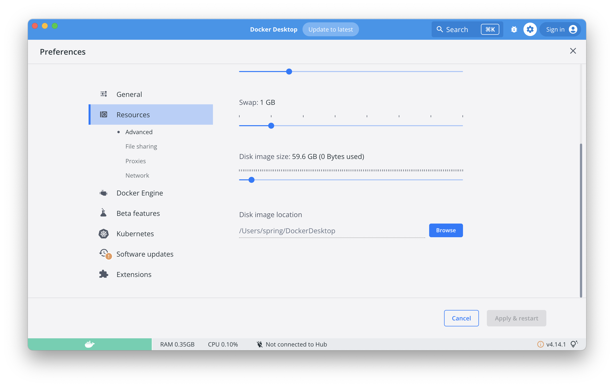
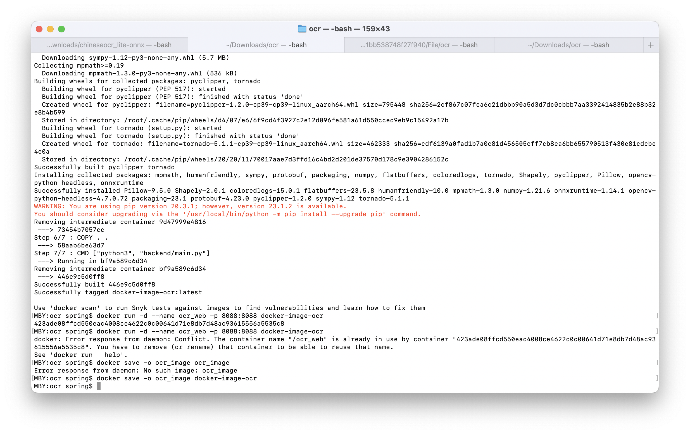

文本主要介绍了M1 MBP上使用Docker构建Python Flask程序镜像的主要问题，并进行导出和使用；

<!--more-->

### P1：缺少Dockerfile，image构建失败。
1. Docker Engine；

```
{
  "builder": {
    "gc": {
      "defaultKeepStorage": "20GB",
      "enabled": true
    }
  },
  "debug": true,
  "experimental": false,
  "features": {
    "buildkit": false
  },
  "insecure-registries": [],
  "registry-mirrors": [
    "http://hub-mirror.c.163.com",
    "https://docker.mirrors.ustc.edu.cn"
  ]
}
```
* 检查Docker Engine，并M1 Desktop Docker中修改；


2. build image；
`sudo docker build -t IMAGE_NAME FILE_PATH` 

* 构建失败。
原因：缺少Dockerfile； 

解决：需在Python项目中建立Dockerfile；


`docker build -t docker-image-test-10 .`构建成功；


3. container run
`docker run -d --name ocr_web -p 8088:8088 image_name` 启动镜像；


### P2：ImportError: libGL.so.1: cannot open shared object file: No such file or dir；
* 修改`Dockerfile`，添加`apt-get`相关依赖；

```bash
FROM ubuntu:latest
MAINTAINER itdream "itdream6@163.com"
RUN sed -i s@/archive.ubuntu.com/@/mirrors.aliyun.com/@g /etc/apt/sources.list
RUN apt-get clean
RUN apt-get update
RUN apt-get install libgl1 ffmpeg libsm6 libxext6 -y


CMD echo "OCR Web building ..."
ENTRYPOINT echo "HELLO DOCKER"

# 原始命令
RUN apt-get install -y vim

#设置python环境镜像
FROM python:3.9.0

# 设置src文件夹是工作目录
WORKDIR /tmp
ADD . /tmp

# 安装相应的python库
RUN pip install -r requirements.txt
pip uninstall opencv-python -y
pip install opencv-python-headless -i https://pypi.tuna.tsinghua.edu.cn/simple

COPY . .

# 执行Python程序（网页程序主程序）
CMD ["python3", "backend/main.py"]
```


### P3：apt-get 后仍缺少libGL.so.1；
1. 取消在`Dockerfile`中安装组件，`requirement`使用`opencv-python-headless`替代`opencv-python`；



2. 简化`Dockerfile`并重新构建；

```bash
FROM ubuntu:latest

#设置python环境镜像
FROM python:3.9.0

# 设置src文件夹是工作目录
WORKDIR /tmp
ADD . /tmp

# 安装相应的python库
RUN pip install -r requirements.txt

COPY . .

# 执行Python程序（网页程序主程序）
CMD ["python3", "backend/main.py"]
```

3. 启动Docker服务；




### P4：本地未找到 build image镜像；
* 查找文件位置

* 重新存储文件
`docker save -o ocr_image docker-image-ocr` 
