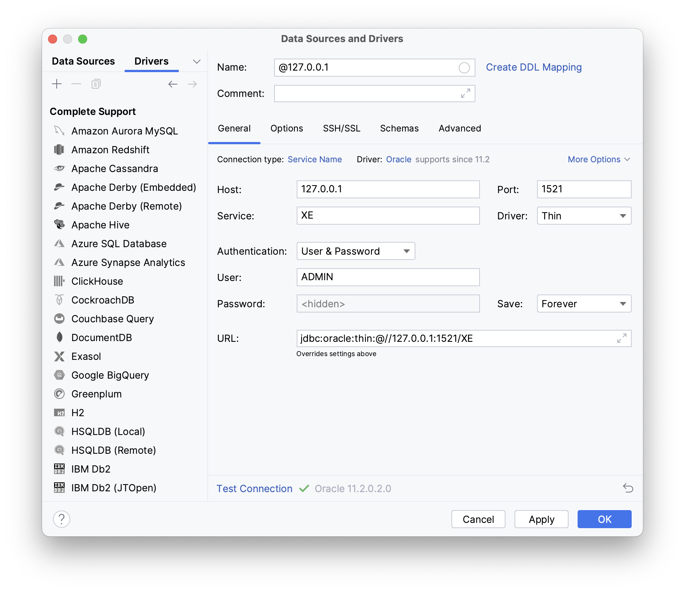

**ARM环境下，通过Colima构建仿真x86_64环境，并使用Docker运行Oracle，实现M1下的Oracle数据库开发环境。**

<!--more-->

> 由于开发环境是ARM架构的，Oracle暂时不支持M1，且M1 Docker对于x86支持还不够完善，故使用的Colima代替，效果用起来是比Docker不错的。

-----------------------

## Docker and Colima 
Colima， Linux和MacOS的开源工具，用于替代Docker Desktop，
Coima要求安装Docker或Podman命令，在Linux上，它还需要Lima。
Colima可指定cpu和memory，并且可以指定cpu架构。

> 源码 → [GitHub](https://github.com/abiosoft/colima)

> 相关文档 → [DDEV Docs](https://ddev.readthedocs.io/en/stable/users/install/docker-installation/)

## Revise docker commands
```Bash
$ docker ps -a 
$ docker system prune
$ docker rmi [image_id]
$ docker container stop [container_id]
$ docker container rm [contaienr_id]
$ docker container start [container_id]
```
> docker ps 无法查看container的情况下，请使用`-a`参数。

## Install M1 Colima and Run With x86_64：
```Bash
$ brew install colima
$ colima start --arch x86_64 --memory 4
$ colima stop
```
> 安装完毕Colima，Docker会崩坏，先`colima stop`，再退出Docker Desktop，再重新安装Docker Desktop即可。

> 也可将无关镜像和容器删除。

## Pull and Use Oracle Image
```Bash
$ docker pull oracleinanutshell/oracle-xe-11g
$ docker run -d --name oracle_11g -p 127.0.0.1:1521:1521 oracleinanutshell/oracle-xe-11g
$ docker exec -it oracle_11g bash
```

```
# su - oracle 
# sqlplus /nolog
# conn / as sysdba
# ALTER PROFILE DEFAULT LIMIT PASSWORD_LIFE_TIME UNLIMITED; --修改密码规则策略为永不过期
# alter system set processes=1000 scope=spfile; --修改最大连接数
# CREATE USER admin IDENTIFIED BY 123456; --创建用户
# GRANT CONNECT, RESOURCE, DBA TO admin; --用户授权
```



线程在创建、销毁的过程中会消耗一些资源，为了节省这些开销，JDK添加了线程池。线程池提高了线程的使用效率，节省了开销。阿里巴巴开发文档中建议在编写多线程程序的时候使用线程池。