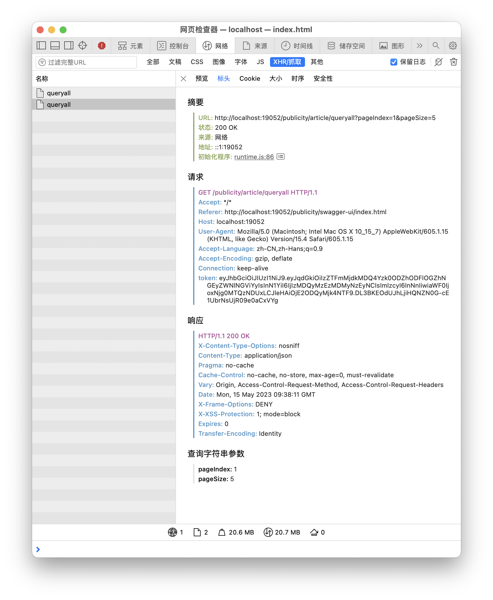

修改配置文件
`post_asset_folder: false`，值改为true。
此时创建新文章需要使用`hexo new "title"`，创建后在`source/_posts`中会创建同名文件夹，用于存储asset image。

`post_asset_folder`模式下引用图片两种写法：
1. 不安装图片插件，仅开启post_asset_folder配置

1. 安装hexo-image-link插件
`npm install hexo-image-link --save`
