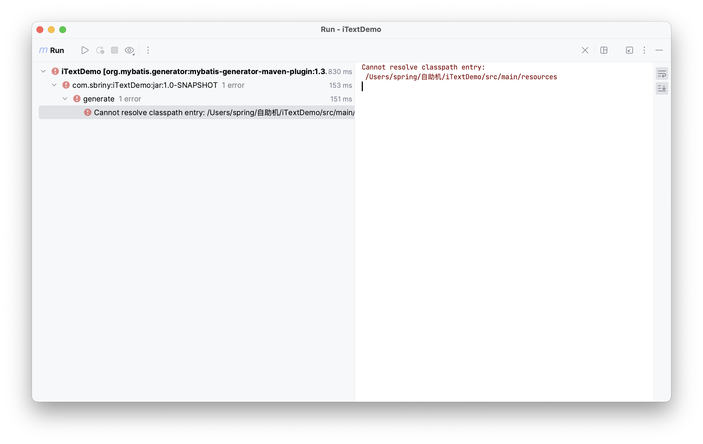

### Generator POM Plugin
error：`Could not find artifact com.oracle.database.jdbc:ojdbc-bom:jar:21.7.0.0 in central (https://repo.maven.apache.org/maven2)`

解决：
1）下载jar
在地址下载对应的ojdbc依赖：
[JDBC and UCP Downloads page](https://www.oracle.com/database/technologies/appdev/jdbc-downloads.html)
2）导入mvn
控制台命令安装：
`mvn install:install-file -DgroupId=com.oracle -DartifactId=ojdbc8 -Dversion=11.2.0 -Dfile=/Download/ojdbc8`
3）配置pom
```XML
<dependencies>
    <groupId>com.oracle</groupId>
    <artifactId>ojdbc8</artifactId>
    <version>11.2.0</version>
</dependencies>
```
4）reload

### New Project No resources
error:
`Cannot resolve classpath entry: /xxx/xxx/src/main/resources`

solve:
POM中配置了build resource，而项目结构缺少resources，所以需要创建。


未启动数据库系统。