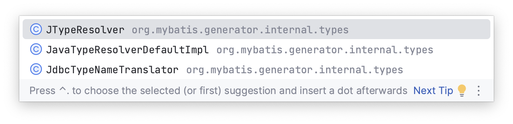

由Oracle Generator BigDecimal转化问题引发的一系列MyBatis Generator问题。

1.修改轮子；
自定义Oracle Generator Decimal类型转换器，继承JavaTypeResolver接口。
重写这个轮子的时候要注意一下几点：
原本的内部类（JdbcTypeInformation）的路径问题；
2.打包轮子；
3.导入轮子；
4.测试。

Listener refused the connection with the following error:
ORA-12528, TNS:listener: all appropriate instances are blocking new connections