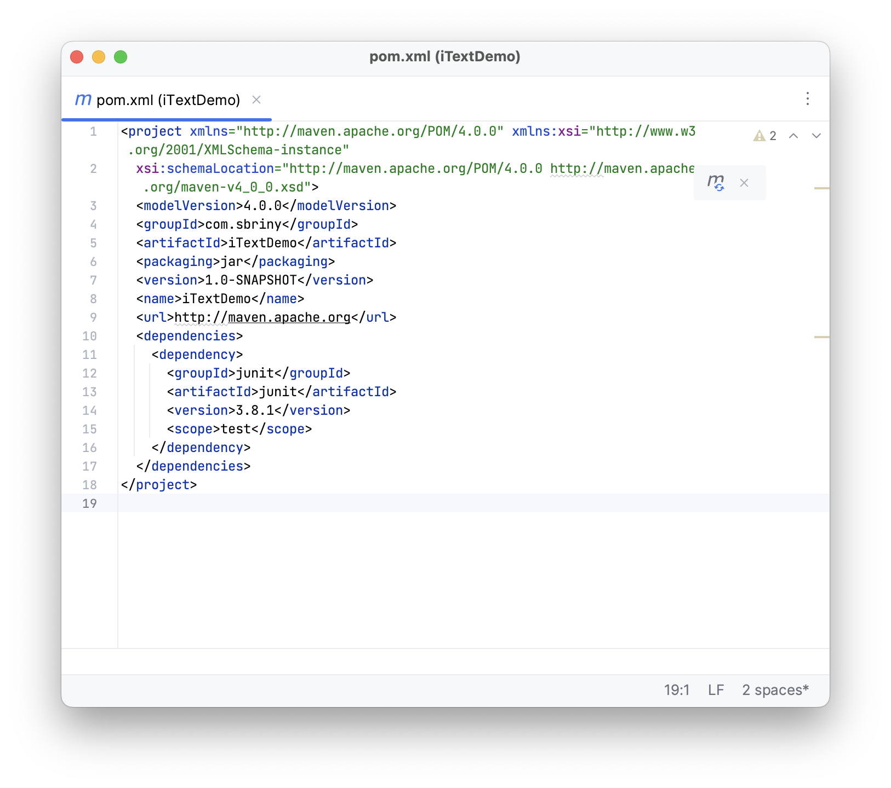
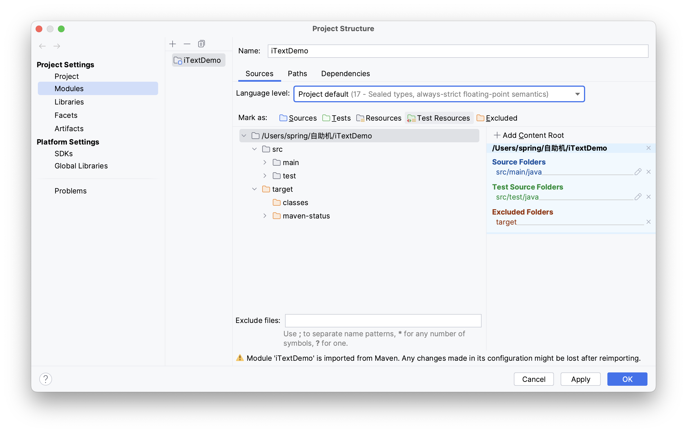
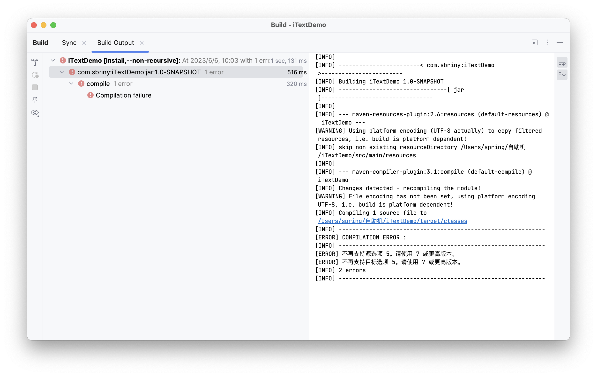
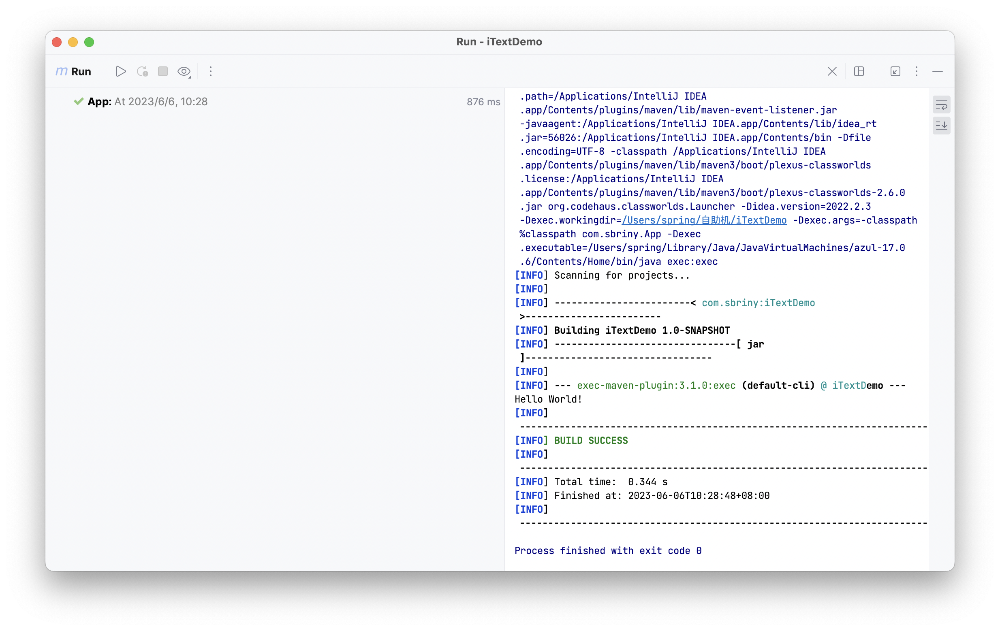

<!--more-->
mvn创建了个小的分模块Demo，run build的时候竟然提示JDK版本有问题。  
因为是命令行新建的项目，POM都是默认的。

从Maven导入的模块中，无法切换Language Level，但是项目的JDK版本和LV都正常。

且修改会提示：`Module is imported from Maven. Any changes made in its configuration might be lost after reimporting`  
只要保存修改后就会发生编译错误：

返回发现LV配置并未生效。

问题原因是因为POM中也需要设置JDK版本。没有设置所以每次修改POM后重新运行都会回复默认版本1.5。
编辑POM Build。
在POM Build结构中添加compiler插件代码：
```XML
<build>
    <plugins>
        <plugin>
        <groupId>org.apache.maven.plugins</groupId>
        <artifactId>maven-compiler-plugin</artifactId>
        <version>3.8.0</version>
        <configuration>
            <source>1.8</source>
            <target>1.8</target>
        </configuration>
        </plugin>
    </plugins>
</build>
```
也可以在Properties中添加compiler：
```XML
<properties>
    <maven.compiler.source>8</maven.compiler.source>
    <maven.compiler.target>8</maven.compiler.target>
    <project.build.sourceEncoding>UTF-8</project.build.sourceEncoding>
</properties>
```
两种方法修改后Build Run正常。
